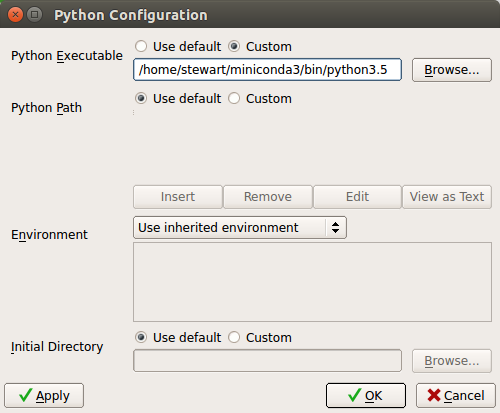

****************
Install On Linux
****************

Install Miniconda Python 3.7
------------------------------

#. To get started you need to download the correct version of the linux miniconda
   installer for your operating system.

   a. Your computer has to be running a 64-bit version of Linux
      in order to be able to run the latest version of Wing IDE 101.
      Use the link https://repo.continuum.io/miniconda/Miniconda3-latest-Linux-x86_64.sh
      If you are unsure of which system you are running, see
      `Detecting 64-bits versus 32-bits Linux Systems`_.

   #. Wait for it to download.  It will place a file called
      **Miniconda3-latest-Linux-x86_64.sh** in your downloads
      folder. On my computer using Firefox this is ~/Downloads

#. Open a *Terminal* window. If you don't know how to do this click 
   *Applications -> Terminal* or search for "Terminal" in the Ubuntu dock search.

#. Within *Terminal* change the directory into the folder where your downloaded file lives, i.e.:
   
   ::

       cd ~/Downloads

#. Now run the bash "shell" program to install Miniconda:

   ::

       bash Miniconda3-latest-Linux-x86_64.sh

6. Scroll through the license (press the space bar to move through
   quickly), type 'yes' to approve the terms, and then accept all the
   installation defaults.

#. Close the Terminal program.  Then, restart it.

#. Within Terminal type:

   ::

       conda install pillow

   b. Enter *y* at the *Proceed* prompt.

   #. When the installation completes, close the Terminal window.

Install Wing IDE 101 and Connect It to Miniconda Python
-------------------------------------------------------

The second half of the installation is the Wing IDE 101 development
environment.  This is the software that you use to write, edit, and
test your Python programs. Wing IDE 101 calls Python to actually run the
program.  Therefore, we have to download and install Wing IDE 101 and then
tie it to the Miniconda version of Python.

#. Go to http://wingware.com/downloads/wingide-101

#. Download the installer for your operating system. For Linux
   this downloads an installation deb package.  Double click on it to
   install and follow the instructions in the Software Center. As with miniconda,
   you may need to answer of few questions and accept the license agreement. You
   should use the default settings.

#. Open the Wing IDE 101 application.  We'll explore this application in
   lecture and in lab, but for now we just need to tell Wing about
   Miniconda Python.  To do this, click on the menu and then *Edit ->
   Configure Python*

#. For the Python Executable click on *Custom* and then *Browse* to the
   location for the Miniconda Python executable.  This will be something like
   */home/stewart/miniconda3/bin/python3.7* See the following:

5. Ignore the Python Path and all other settings and click OK.

#. Back in the main Wing IDE 101 it may ask you to restart the python
   shell.  Once you do then you should see at the top of the Python
   Shell window pane something about "3.7 \|Continuum Analytics,
   Inc." etc.  If you have this you are all set and the installation
   is complete!

Detecting 64-bits versus 32-bits Linux Systems
----------------------------------------------

To determine if you are running 64- or 32-bit Linux, simply open up a Terminal
window and type:

::

   uname -m

This will either output "i686" (or something not "x86_64") for 32-bit or "x86_64"
for 64-bit

