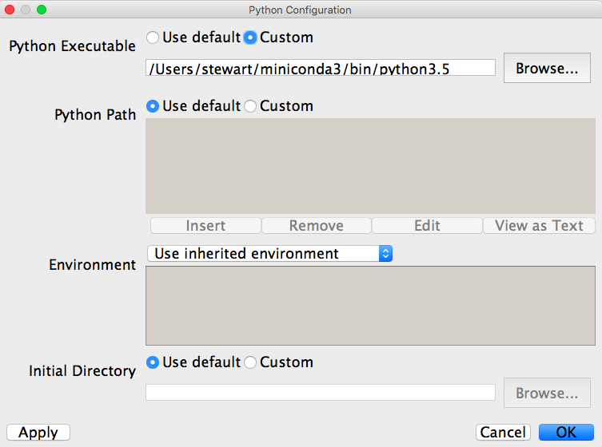

*******************
Install On Mac OS X
*******************

Install Miniconda Python 3.7
------------------------------

#. To get started you need to download the OSX miniconda
   installer. 
   
   a. Click on the link https://repo.continuum.io/miniconda/Miniconda3-latest-MacOSX-x86_64.sh

   #. Wait for it to download.  It will place a file called
      **Miniconda3-latest-MacOSX-x86_64.sh** in your downloads
      folder. On my computer using Safari this is ~/Downloads

#. Open a *Terminal* window. If you don't know how to do this click *Applications -> Utilities -> Terminal*

#. Within *Terminal* change directories into the folder where your downloaded file lives, i.e.:
   
   ::

       cd ~/Downloads

#. Now run the bash "shell" program to install Miniconda:

   ::

       bash Miniconda3-latest-MacOSX-x86_64.sh

6. Scroll through the license (press the space bar to move through
   quickly), type 'yes' to approve the terms, and then accept all the
   installation defaults.

#. Close the Terminal program.  Then, restart it.

#. Within the Terminal type:

   ::

       conda install pillow

   b. Enter *y* at the *Proceed* prompt.

   #. When the installation completes, close the Terminal window.

Install Wing IDE 101 and Connect It to Miniconda Python
-------------------------------------------------------

The second half of the installation is the Wing IDE 101 development
environment.  This is the software that you use to write, edit, and
test your Python programs.  Wing IDE 101 calls Python to actually run the
program.  Therefore, we have to download and install Wing IDE 101 and then
tie it to the Miniconda version of Python.

#. Go to http://wingware.com/downloads/wingide-101

#. Download the installer for your operating system.  For Mac OS X
   this downloads an installation dmg package.  Double click on it to
   install and follow the instructions. As with miniconda, you may
   need to answer of few questions and accept the license
   agreement. You should use the default settings. If you see a
   security problem, see :ref:`security_exceptions_label`.

#. Open the Wing IDE 101 application.  We'll explore this application in
   lecture and in lab, but for now we just need to tell Wing about
   Miniconda Python.  To do this, click on the menu and then *Edit ->
   Configure Python*

#. For the *Python Executable* click on *Custom* and then *Browse* to the
   location for the Miniconda Python executable.  On my Mac this is
   */Users/stewart/miniconda3/bin/python3.7*  See the following:

5. Ignore the *Python Path* and all other settings and click OK.

#. Back in the main Wing IDE 101 it may ask you to restart the Python
   shell.  Once you do then you should see at the top of the Python
   Shell window pane something about "3.7 \|Continuum Analytics,
   Inc." etc.  If you have this you are all set and the installation
   is complete!

Detecting 64-bits versus 32-bits Mac OS X Systems
-------------------------------------------------

You are running 64-bit Mac OS X.

*Technically, all Apple computers purchased since Q4 2006 have been equipped with
64-bit capable processors.  The Mac OS X operating system has supported 64-bit by
default since OS X 10.6 Snow Leopard, released in 2009.  The upgrade to the latest
operating system for your computer is available for free, directly from Apple,
since the release of OS X 10.9 Mavericks in 2013.*

.. _security_exceptions_label:

Security Problems
-------------------

For OS X 10.7 and later: The installation of a software package like
Wing 101 might fail due to a security feature, called *Gatekeeper*. If
you have a problem, you will get a message that looks like:

   ::

      "Wing 101"  can't be opened because it is from an unidentified developer.

**Option 1: One time security bypass:**
      
To temporarily bypass Gatekeeper, right-click (or Control-click) on
the app’s icon and select Open. You’ll still receive an alert message,
but this time it’s only a warning. Clicking Open again will launch the
app.

We recommend that you do not make a habit of using this bypass
however. Use this method, only if you are certain that there is no
security risk with the software you are installing, such as Wing 101.

**Option 2: Disable security feature, install and re-enable it:**

In this second method, you will disable gatekeeper first, install the
software, then re-enable it. Unfortunately, this has been made
difficult for later versions of Mac OS X like Sierra. So, we will
offer two methods to do this. Option 2.2 should apply to all versions,
but not recommended for users new to Unix.

**Option 2.1: Try the following instructions (earlier versions of OS X):**

* Click the Apple icon in the menu bar and select ``System Preferences``.
* Go to ``Security & Privacy`` --- It is located in the first row, which is entitled ``Personal``.
* Click on the ``General`` tab.
* ``Authenticate``:  Click on the lock at the bottom-lefthand corner of the screen and subsequently input your computer user account password.
* In the bottom half of the ``General`` tab, there will be the following choices:

    * Allow applications downloaded from:

        * \(  \) Mac App Store
        * \(X\) Mac App Store and identified developers
        * \(  \) Anywhere

  If you cannot see the option ``Anywhere``, follow instructions for
  **Option 2.2** below.
  
* Select ``Anywhere`` and select ``Allow From Anywhere`` in the subsequent dropdown warning.  We will be re-enabling this feature after the installer is completed.   
* Install the software package.
* Once the installer has completed, go back to the ``System Preferences`` window and re-select the option

    * Allow applications downloaded from:

        * \(  \) Mac App Store
        * \(X\) Mac App Store and identified developers
        * \(  \) Anywhere

* This will return the security settings back to normal.
* Close ``System Preferences`` window.

**Option 2.2: Terminal solution (later versions of OS X):**

In Sierra, OS X got rid of the ``Anywhere`` option. So, you will need to
use a different method for allowing this. As this method makes a
permanent change to your computer that is not visible from an
interface, we recommend you ask help from a TA or a mentor to follow
these steps.

Open a Terminal window from ``Applications->Utilities``. Type the
following command:

  ::

     sudo spctl --master-disable

This will ask you to type in your password, which is likely the
administrator password for the computer. This enables software to be
installed from any source. Now you should be able to install any
software.

As in Option 2.1, we want to revert back to the original settings
after this action. Once you are done with the installation, again
using a Terminal, type the following command:

  ::

     sudo spctl --master-enable

This should restore the original security settings. A word of
caution, do not use the sudo option on a regular basis as this
bypasses all security settings. Some of us caused real harm to our
computers by using this command unwisely.
